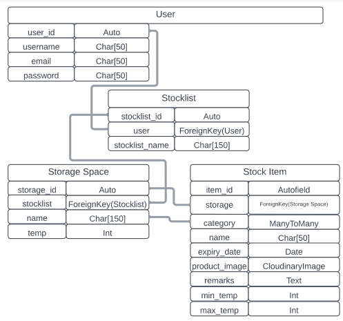

# My Pantry Note
(Developer: Kamil Wojciechowski)

[Live webpage]()

## About 

My Pantry Note - 4th Portfolio Project for Diploma in Full Stack Software Development with Code Institute. It is a full stack website built using Django to help users keep track of their food stock at home. The idea was inspired by the hardships of the cost of living crisis to provide for users a simple mean useful in avoiding spending money for food products that often may expire and be wasted before consumers want to eat them. 

## Table of Contents

1. [Project Goals](#project-goals)
    - [User Goals](#user-goals)
    - [Business Owner Goals](#business-owner-goals)
2. [User Experience](#user-experience)
    - [Target Audience](#target-audience)
    - [User Requirements and Expectations](#user-requirements-and-expectations)
    - [User Stories](#user-stories)
    - [Agile Methodologies](#agile-methodologies)
3. [Design](#design)
    - [Colors](#colors)
    - [Typhography](#typhography)
    - [Imagery](#imagery)
    - [Wireframes](#wireframes)
4. [Database Diagram](#database-diagram)
5. [Messages and Interaction With Users](#messages-and-interaction-with-users)
6. [Admin Panel/Superuser](#admin-panelsuperuser)
7. [Technologies Used](#technologies-used)
   - [Languages](#languages)
    - [Django Packages](#django-packages)
   - [Libraries & Frameworks](#libraries-&-frameworks)
8. [Features](#features)
9. [Validation](#validation)
10. [Accessibility](#accessibility)
11. [Performance](#performance)
12. [Device Testing](#device-testing)
13. [Browser compatibility](#browser-compatibility)
14. [Testing](#testing)
15. [Creating the app using Django](#creating-the-app-using-django)
16. [Bugs](#bugs)
17. [Deployment](#deployment)
18. [Credits](#credits)
19. [Acknowledgements](#acknowledgements)

## Project Goals

### User Goals

### Business Owner Goals

[Back to Table Of Contents](#table-of-contents)

## User Experience

### Target Audience

### User Requirements and Expectations

### User Stories

#### Users

As a User I want to:

#### Site Owner

As an Admin I want to:

### Agile Methodologies

[Back to Table Of Contents](#table-of-contents)

## Design

### Colors

### Typhography

### Imagery

### Wireframes

[Back to Table Of Contents](#table-of-contents)

## Database Diagram

## Messages and Interaction With Users

## Admin Panel/Superuser

[Back to Table Of Contents](#table-of-contents)

## Technologies Used

- [GitHub](https://github.com/)
- [Gitpod](https://gitpod.io/)
- [Heroku](https://id.heroku.com/)
- [Lucidchart](https://lucid.app/)
- [Fontawesome](https://fontawesome.com/)
- [Google Fonts](https://fonts.google.com/?fbclid=IwAR0M5mybiiO6URy8GMzAKIYHRdX_lQHlJhwcmI6h-bNFuL90-osnCNZaC8Q)
- [Balsamiq](https://balsamiq.com/)
- [CI Python Linter](https://pep8ci.herokuapp.com/)

### Languages

#### Django Packages

### Libraries & Frameworks

[Back to Table Of Contents](#table-of-contents)

## Features

[Back to Table Of Contents](#table-of-contents)

## Validation 

[CI Python Linter](https://pep8ci.herokuapp.com/) was used to perform the check if the code meets PEP8 requirements. All clear, no errors found:

[Back to Table Of Contents](#table-of-contents)

## Accessibility

## Performance

## Device Testing

## Browser compatibility

## Testing

Click to see user stories testing

---------------------------------------------------------------

| Feature | Action  | Expected Result | Actual Result |
| ------- | ------- | --------------- | ------------- |
| | |  |  |

[Back to Table Of Contents](#table-of-contents)

## Creating the app using Django

## Bugs

| Bug  | Fix  |
| ------- | ------- |
| Heroku error during the early deployment: "Failed building wheel for backports.zoneinfo" |  Edit requirements.txt file. update backports from backports.zoneinfo==0.2.1 to
backports.zoneinfo==0.2.1;python_version<"3.9" |
|  |  |

[Back to Table Of Contents](#table-of-contents)

## Deployment

[Back to Table Of Contents](#table-of-contents)

## Credits 

- Information regarding food waste found on <a href="https://www.epa.ie/our-services/monitoring--assessment/waste/national-waste-statistics/food/">the Environmental Protection Agency (EPA) website</a>.

- Website's background based on <a href="https://css-tricks.com/snippets/css/transparent-background-images">CSS Tricks</a>.

- Some of the styles inspired by the knowledge from my Project Portfolio 2:<a href="https://github.com/WojtekKamilowski/CI_PP2_WOTM">what'sOnTheMenu</a>.

- based on .

### Media

- All icons found on <a href="https://fontawesome.com/">Fontawesome</a>.

- Font Fira Sans found on <a href="https://fonts.google.com/specimen/Fira+Sans?fbclid=IwAR0M5mybiiO6URy8GMzAKIYHRdX_lQHlJhwcmI6h-bNFuL90-osnCNZaC8Q">Google Fonts</a>.

- Font PT Serif found on <a href="https://fonts.google.com/specimen/PT+Serif?fbclid=IwAR0M5mybiiO6URy8GMzAKIYHRdX_lQHlJhwcmI6h-bNFuL90-osnCNZaC8Q&query=PT+Serif">Google Fonts</a>.

[Back to Table Of Contents](#table-of-contents)

## Acknowledgements
I would like to thank those who were a great support and inspiration during writing this project:
- My wife, who supported me during the process of creating this project.
- My mentor Mo Shami.
- Code Institute for preparing the materials and providing a wide range of available means of learning for the students.